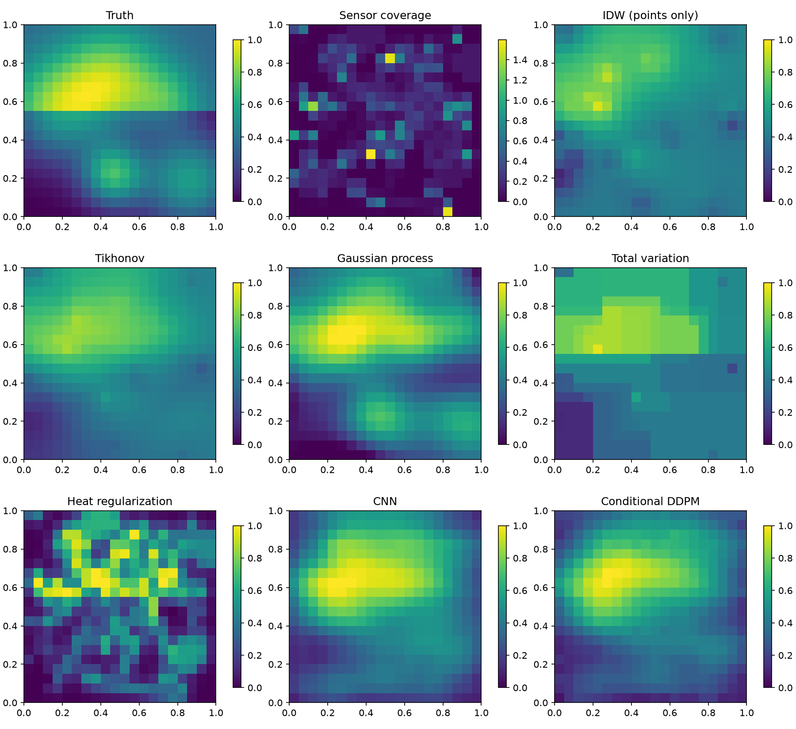

# Field Reconstruction Lab

**From pixels to physical fields: signal processing, sensor geometry, classical
inverse problems, Bayesian inference, neural networks, and generative diffusion.**

This repository expands the original microwave-link spatial-interpolation
project into a runnable teaching and research lab. Start with images as sampled
fields, learn what points/lines/footprints observe, and reconstruct 1D and 2D
fields. Finish with tomography and projections of 3D density fields.

## Start in five minutes

```bash
python3 -m venv .venv
source .venv/bin/activate
python -m pip install -e '.[ml,teaching,test]'
fieldlab --output results/simulation
# Adds actual training of both neural models:
fieldlab --output results/learned --ml-steps 200
# Visual report: open results/learned/index.html in your browser
python -m ipykernel install --prefix .venv --name fieldlab --display-name "Field Reconstruction Lab"
jupyter lab tutorials
```

On CPU, small teaching experiments should complete in minutes; actual runtime
varies with the machine. No pretrained weights or GPU are required.

## Example output



[Open the local visual report](docs/demo/index.html). The report includes actual
measured errors, sensor geometry, training curves, and uncertainty maps.

## Seven implemented models

| Model | Method | Sensors | Uncertainty |
|---|---|---|---|
| Inverse-distance weighting | Classical point interpolation | Points | None |
| Tikhonov | Weighted inverse problem + gradient penalty | All linear supports | None returned |
| Smoothed anisotropic TV | Edge-aware regularized inversion | All linear supports | None |
| Heat/Landweber | Stable data-fit + diffusion regularization | All linear supports | None |
| Gaussian process | Bayesian RBF prior with linear observations | All linear supports | Exact conditional std for fixed assumptions |
| Supervised CNN | Learned synthetic-field reconstruction | Fixed 2D sensor layout | None |
| Conditional DDPM | Learned denoising diffusion + heuristic consistency | Fixed 2D sensor layout | Sample spread, **not calibrated posterior** |

Filtered backprojection is also demonstrated for 2D tomography. Every model is
implemented or explicitly routed to the documented scikit-image FBP routine;
the learning models really train. The default comparison is educational, not
a claim that a tiny diffusion model beats classical reconstruction.

## Tutorials and theory

1. [Pixels, sampling, and Fourier analysis](tutorials/01_pixels_sampling.ipynb)
2. [Point, line, and footprint operators](tutorials/02_sensor_operators.ipynb)
3. [Classical reconstruction](tutorials/03_classical_models.ipynb)
4. [Bayesian fields and uncertainty](tutorials/04_bayesian_fields.ipynb)
5. [Supervised CNN](tutorials/05_neural_reconstruction.ipynb)
6. [Conditional generative diffusion](tutorials/06_diffusion.ipynb)
7. [Real data: temperature and images](tutorials/07_real_data.ipynb)
8. [Tomography and 3D projections](tutorials/08_projections.ipynb)
9. [Sensor fusion and CML calibration](tutorials/09_sensor_fusion.ipynb)
10. [Controlled evaluation](tutorials/10_evaluation.ipynb)
11. [Real 2D physical temperature maps](tutorials/11_real_physical_map.ipynb)
12. [Analytic physical heat fields](tutorials/12_physical_heat_fields.ipynb)

See [checked numerical results](docs/verified/README.md).

Read the [theory notes](docs/theory.md), [teaching plan](docs/course.md), and
[data provenance and CSV format](docs/data.md).

## Reproduce the examples

```bash
fieldlab --output results/simulation --seed 42 --ml-steps 200
fieldlab --real --output results/real_image
python -m examples.real_temperature    # NASA download; internet required first time
python -m examples.real_temperature_map # real NASA 2D field; 23 MB first download
python -m examples.tomography
python scripts/evaluate_learning.py --steps 200 --seeds 5 # seven models, identical data
python scripts/evaluate.py --seeds 5   # all five classical estimators; matched point data
pytest -q
python scripts/execute_notebooks.py    # executes every notebook, including neural training
```

Reports contain actual RMSE, MAE, sensor residuals, model diagnostics, saved
arrays, figures, and an HTML overview. Neural runs also save checkpoints,
training curves, and diffusion samples. Train fields and test field use distinct
seeds. NASA data are real observations; the photograph is real but its sensor
measurements are simulated. No real CML performance is claimed without a
calibrated dataset.

## Layout

- `fieldlab/`: measurement operators, field generators, estimators, training,
  data adapters, and benchmark CLI.
- `tutorials/`: executable lesson notebooks with exercises.
- `examples/`: real 1D temperature and simulated 2D/3D tomography.
- `tests/`: operator correctness, inversion, uncertainty, and learning checks.
- `Iterative/`: preserved original GMZ code and student notebook.

Dense algorithms intentionally favor readable math over large-scale speed.
Default grids are 20×20. CNN/DDPM support 2D; classical solvers and operators
support 1–3D small grids. Projection demos do not claim to reconstruct a volume
from a single view. See theory notes for scale and identifiability limits.

## Original project and attribution

The original project implements GMZ rainfall distribution along microwave
links, described in the original README as Goldshtein et al. (2009).
Original contributors: **Adam Eshel and Daniel Serebranik**. Their source and
notebook remain in `Iterative/`; the new lab does not claim authorship of them.
The inherited repository does not include a license; no blanket license is
assigned to inherited material. External datasets retain their own terms.
